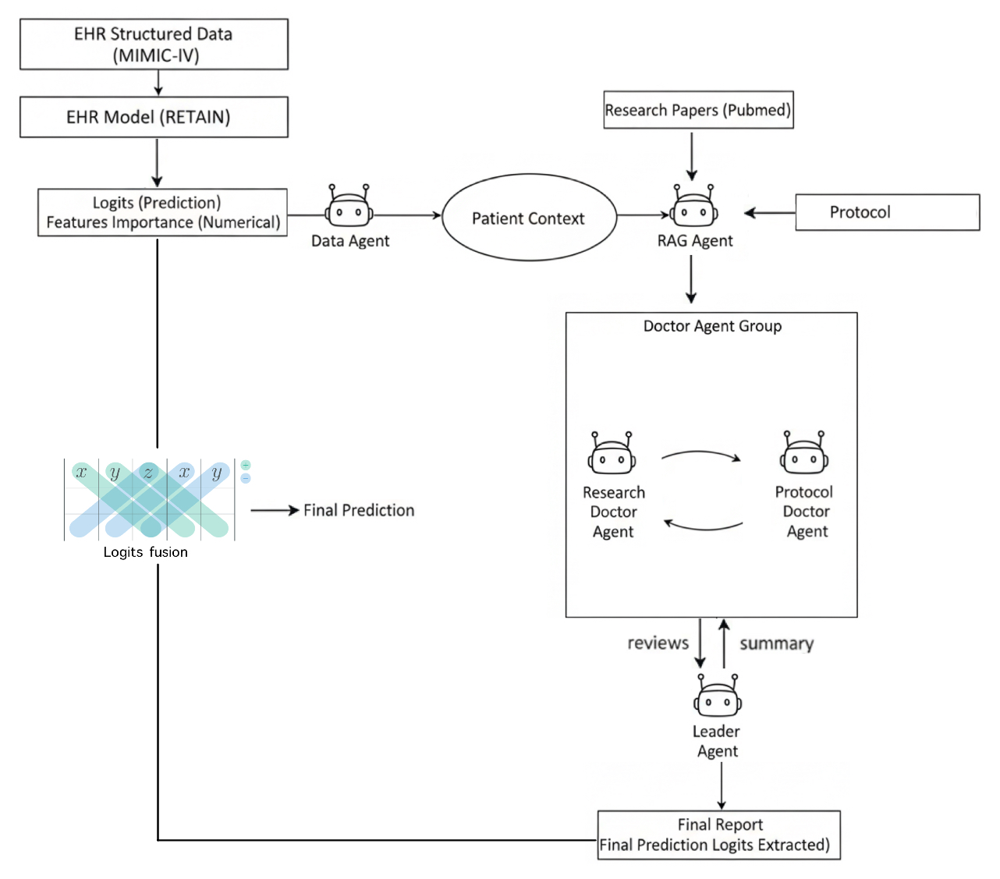
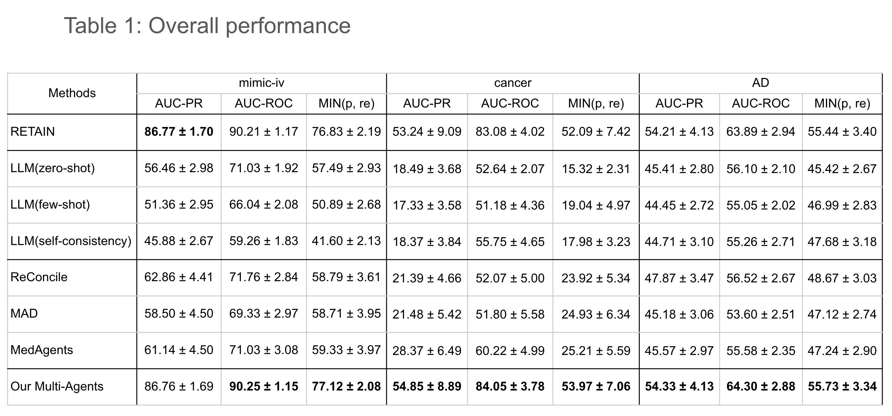
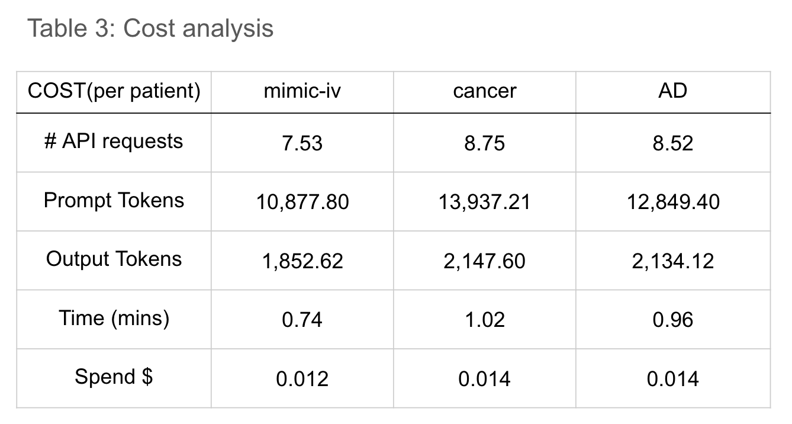

# Multi-Agent LLM-Driven Framework for Enhanced EHR Modeling and Clinical Outcome Prediction (Demo)

This project implements a multi-agent LLM framework to enhance prediction and interpretation of clinical outcomes for ICU patients.

The system integrates a deep learning EHR model (RETAIN) with multiple LLM agents that leverage clinical guidelines, research literature, and structured EHR signals to produce transparent, clinically aligned reports.

# 📊 Dataset

[](https://colab.research.google.com/github/EileenDLS/MAS_demo/blob/main/mimic4_preprocessing.ipynb)

**Source:** [MIMIC-IV (v3.1)](https://physionet.org/content/mimiciv/3.1/)

**Population:** ICU patients with AKI + tubular necrosis diagnosis

**Data:** Demographic info, Lab test features, vitals

# Tasks
In-hospital Mortality Prediction

# 🚀 Overview of the Framework


# RETAIN model
```
Patient Historical Visit Records
x1, x2, …, xT  (diagnoses / medications / labs for each visit)
        │
        ▼
[Embedding Layer]
Convert each visit into a vector representation
        │
        ├──▶ RNN1 → α1, α2, …, αT   (visit-level attention)
        │        (decides which visits are important)
        │
        └──▶ RNN2 → β1, β2, …, βT   (variable-level attention)
                 (decides which variables within a visit are important)
        │
        ▼
[Weighted Representation]
h = Σ αt · (βt ⊙ xt)
        │
        ▼
[Prediction Layer]
y = sigmoid(W·h + b)   (e.g., probability of disease)
```
[RETAIN: An Interpretable Predictive Model for Healthcare using Reverse Time Attention Mechanism](https://arxiv.org/pdf/1608.05745)

# Multi-Agents Systems (MAS)

[](https://colab.research.google.com/github/EileenDLS/MAS_demo/blob/main/EHRCare_MAS.ipynb)

**Data Agent**: Converts EHR model outputs into an LLM-readable patient summary

**RAG Agent**: Retrieves external knowledge

**Research Doctor Agent**: Leverages lastest research papers to provide evidence-based insights.

**Protocol Doctor Agent**: Uses clinical practical guidelines to inform practical recommendations.

**Leader Agent**: Summarizes and coordinates outputs from the two doctor agents.

**Large Language Model**: Llama-3.3-70b-instruct ([NaviGator API](https://it.ufl.edu/ai/navigator-toolkit/))

# Corpus
**1. medical guideline**: [Merck Manual of Diagnosis and Therapy (professional version)](https://www.msdmanuals.com/professional)

**2. lastest research**: [PubMed](https://pubmed.ncbi.nlm.nih.gov/)

[(response demo)](demo_data/response_demo.jpg)

# Performance




